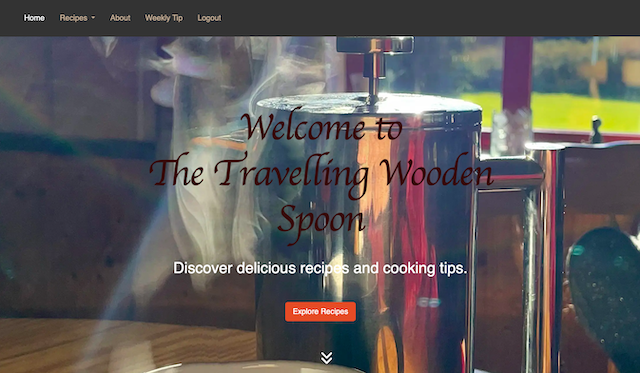
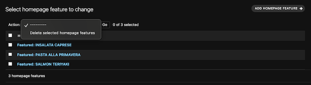
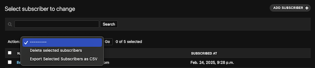

# The Travelling Wooden Spoon - Food Blog

## Table of Content

- [About the project](#about-the-project)
- [Features](#features)
  - [Existing Features](#existing-features)
  - [Features left to implement](#features-left-to-implement)
- [The Admin Panel](#the-admin-panel)
  - [Features](#features)
  - [Actions and Filters](#actions-and-filters)
  - [Adding and Editing Entries](#adding-and-editing-entries)
- [Security Features and Error Handling](#security-features-and-error-handling)
- [Testing](#testing)
  - [Initial Checks](#initial-checks)
  - [Page performance](#page-performance)
  - [Bugs and Resolutions](#bugs-and-resolutions)
  - [Validator Testing](#validator-testing)
  - [Automated Testing](#automated-testing)
-  [Technology Stack](#technology-stack)
-  [Deployment](#deployment)
-  [Usage](#usage)
-  [Contribution](#contribution)
- [Acknowledgement](#acknowledgement)
  - [Content](#content)
  - [Media](#media)
- [Author](#author)
- [License](#license)

## About the project
Cooking has always been a passion of mine, a way to decompress from a stressful day at work, a reward for a difficult or tenuous task successfully completed, a way to bring people together and a way of communication. The idea of creating a food blog has been on my mind for years. When people around me kept telling me they loved my dishes and all the little tips that came with them I finally decided it was time to go ahead and create The Travelling Wooden Spoon.

The Travelling Wooden Spoon is a dynamic blog application focused on recipes, weekly cooking tips, and engaging user interactions. Users can browse recipes, view blog posts, create an account in order to rate recipes or leave comments, read weekly tips, and sign up for a weekly newsletter to stay up to date. 

The application supports a rich feature set, including user authentication, newsletter subscriptions, and automated blog updates when new recipes are published.

Admins can manage the content through the Django Admin Panel, utilizing tools like Summernote for styling their posts making them truly individual. They will love the history panel, that allows them to keep track of their post history, the scheduling section for creating and queueing posts in advance, then schedule them for future release and the option to export an up-to-date list of subscribers in CSV-format for mailings.

The Travelling Wooden Spoon is a feature-rich platform for recipe enthusiasts. Its robust backend ensures seamless content management, while the frontend delivers a user-friendly experience. With the bugs resolved and planned enhancements, the project is well-positioned for growth and engagement.

The live link can be found here - https://the-travelling-wooden-spoon-499c1c443de1.herokuapp.com/

## Features

### Existing Features

## Color Palette

The color palettes, dark earthy tones, are used throughout the project. The earth in which vegetables grow is auburn, the plants that grow fruits are green and color of the kitchen staff is white. The colors stand in a wonderful contrast to the bright and colourful images of the dishes. The clear message here is that cooking is fun, satisfying and rewarding. Food brings us together, food is a topic everyone has something to say about. A good meal lifts our spirit and the colours chosen, together with the overall layout of the page, invite the user to stick around and explore.

## Landing page

The homepage of **The Travelling Wooden Spoon** is designed to be an engaging, user-friendly introduction to the blog, seamlessly guiding visitors from discovery to deeper engagement with featured recipes, blog posts, and subscription options. It is designed for a **seamless, engaging user experience**, leading visitors from **first impression to deeper exploration** through a well-structured, visually appealing, and intuitive interface.

By integrating **manual and automated content updates**, the homepage remains **dynamic and fresh**, making it easy for visitors to stay engaged and return for more culinary inspiration.

The homepage consists of the following sections:

1. **Hero Section**
2. **Featured Recipes**
3. **Latest Blog Posts**
4. **Popular Recipes**
5. **Newsletter Signup**

Each section is designed with both desktop and mobile responsiveness in mind, ensuring a smooth browsing experience across different devices.

### Hero Section

✨ First Impressions Matter
- The **hero section** is the first thing users see upon landing on the homepage.
- It features a **beautiful morning kitchen scene** with a steaming coffee pot, sunlight streaming through a window, and a cup of coffee in the foreground.
- The **blog name**, *The Travelling Wooden Spoon*, is displayed in **large, elegant typography**.
- Below the title is a tagline: **“Discover delicious recipes and cooking tips.”**
- A **cinnebar red “Explore Recipes” button** is centrally positioned, inviting users to dive deeper.
- A **bouncing down-arrow icon** encourages users to scroll down to the next section.
- **Navigation Options**: Users can either click the **“Explore Recipes”** button (which opens a category overview modal styled like a wooden restaurant board) or use the **navigation bar** to access different sections.

### Featured Recipes
- This section highlights a curated selection of **top recipes**, complete with:
  - **High-quality images** of each dish
  - **Concise descriptions** that include key attributes
  - **Emojis** that visually communicate aspects such as healthiness, preparation time, and suitability for occasions like parties.
  - A **cinnebar red “Read More” button** on each card, leading to the full recipe.
- Maintained via the **Admin Panel**, allowing the blog owner to update it as needed.
- On **mobile devices**, the layout ensures that the next card peeks in slightly, signaling to the user that there’s more to explore.

### Latest Blog Posts
- Displays the **most recently published** recipes.
- This section is **automatically updated** by fetching data from the database.
- Each blog post preview features:
  - **A compelling image**
  - **A short description**
  - **A “Read More” button** leading to the full post.

### Popular Recipes
- Showcases the **highest-rated recipes**, determined by user ratings.
- This section is **dynamically updated** based on ratings stored in the database.
- Like the previous sections, each recipe card includes:
  - **A mouthwatering image**
  - **A brief yet engaging description**
  - **A “Read More” button** to access the full recipe details.

### Newsletter Signup
- The **final section** of the homepage encourages users to **subscribe to the newsletter**.
- Includes a **simple sign-up form** with fields for **Name** and **Email**.
- A **bold cinnebar red “Subscribe” button** allows users to opt-in for weekly cooking tips and updates.

## Category page

The **Category Page** makes discovering new dishes both visually appealing and user-friendly, ensuring an engaging and seamless experience for all food lovers. It provides a **smooth, interactive browsing experience** while maintaining consistency with the platform’s overall design. 
This section retains the visual harmony of the **landing page** but shifts focus to a **featured dish**, displayed prominently on a large **recipe card**. 
Each card showcases:

- A **high-resolution image**
- A **concise yet engaging description**
- **Key attributes** such as health benefits, popularity, and preparation time

### 🎡 Carousel Layout
To enhance user interaction, the **Category Page** features a **carousel layout**. This serves two primary purposes:

1. **Seamless Browsing Experience** – The cards transition smoothly, allowing users to explore dishes effortlessly.
2. **Optimized for Mobile & Tablet Users** – Most users browse on mobile devices, where swiping feels more intuitive than tapping, especially when wearing gloves in colder seasons.

Users can **swipe through different dishes** or **navigate to other categories** via the **dropdown menu** or the **"Recipes" tab** on larger screens.

Each card includes a **bold cinnabar red "Read More" button**, guiding users to the **Recipe Detail Page**. There, they will find:

- Complete recipe details
- Ingredients list
- Step-by-step preparation instructions
- Glossary terms for better understanding

## Recipe_Detail page

The `recipe_detail` section provides a structured, visually engaging layout for presenting recipes. This section highlights key recipe information, ingredients, preparation steps, and additional metadata such as ratings, comments, and categorization tags. It is designed for clarity and ease of use, ensuring users can quickly understand and follow the recipe.
The `rating` and `comment` section at the bottom of the page allow the user to rate the recipe and provide a space for the user to share their thoughts with the blog owner and the community through leaving a comment. Both features drive user interaction and enhance long-term community engagement.

### **Recipe Title & Image**
   - Displays the name of the dish prominently.
   - Includes a high-resolution image of the prepared dish to enhance visual appeal and provide a reference for presentation.

### **Recipe Description**
   - A concise, engaging introduction to the dish.
   - Highlights the key flavor combinations and textures.
   - Provides insight into the occasion and suitability of the dish.

### **Icons for Key Attributes**
   - `⏱️` Quick preparation time.
   - `🎉` Party-friendly.
   - `💖` Romantic/date-worthy.
   - Additional attributes categorized in a glossary.

### **Ingredients List**
   - Clearly organized and formatted.
   - Includes exact quantities for easy repetition of the recipe
   - Differentiates between the main ingredients and additional components of the dish

### **Preparation Steps**
   - Step-by-step instructions to guide users through the cooking process.
   - Utilizes a clear and sequential format for easy readability.
   - Baking or cooking temperatures and times are specified explicitly.

### **Helpful Cooking Tips**
   - Additional insights about key ingredients.
   - Suggestions on ingredient sourcing and possible substitutes.

### **Recipe Tags (Glossary)**
   - Categorization labels for quick reference:
     - `🍎 Healthy`
     - `🏡 Traditional`
     - `🍲 Hearty`
     - `👶 For children`
     - `⏱️ Quick`
     - `🍷 Contains alcohol`
     - `💖 Romantic/date-worthy`
     - `⭐ Favourite`
     - `🎉 Party-friendly`

### **Recipe Credit & Source**
   - Acknowledges the original author or publication.
   - Provides proper attribution for ethical content sharing.

### **User Ratings & Reviews**
   - Displays average rating (out of 5 stars).
   - Allows users to vote and leave comments and delete their comment if they wish to do so
   - Highlights featured comments with timestamps and usernames.

# About Me page

The **About Me** page of *The Travelling Wooden Spoon* serves as an introduction to the blog's creator. It provides insight into my background, passions, and the inspirations behind my journey. The page is structured to offer a personal, engaging narrative while guiding visitors through the main themes of the blog telling them what to expect. It sets the tone for the rest of the blog, inspiring curiosity and engagement.

## Key Features
- **Image**: Section for the profile iamge
- **Personal & Engaging**: Written in a warm, narrative style to connect with the audience.
- **Structured & Readable**: Sections are clearly divided, making it easy to navigate.
- **Call to Action**: Encourages interaction and exploration of the blog.

## Maintenance:
- The "about Me"-page is maintained through the Admin Panel where the blog creator is able to add or change the profile picture as well as the content.

## Weekly Tip

The **Weekly Tip** page provides visitors with helpful culinary tips and insights, updated regularly by the blog creator. This section enhances user engagement by offering practical kitchen knowledge, from measurement conversions to ingredient substitutions. The page is structured to present visually engaging content alongside well-formatted textual explanations. It offers a dynamic way to keep users engaged with fresh and valuable kitchen insights with another option to sign up for the newsletter provided at the bottom. 
With **easy maintenance through the Admin Panel** and enhanced styling via **Crispy Bootstrap**, it ensures a visually appealing and informative experience for all visitors.

## Structure & Features

### 📸 **Featured Image**
- A **prominent image** related to the weekly tip is displayed at the top.
- The image can be **updated through the Admin Panel**.

### 📝 **Weekly Tip Content**
- A **headline** introduces the week's tip in a bold, readable format.
- The main content includes:
  - A **detailed explanation** of the tip.
  - **Practical kitchen advice**

### ⚙️ **Admin Panel Maintenance**
- The **blog creator** can update the page via the **Admin Panel**, enabling:
  - **Image modifications**.
  - **Content updates** for the weekly tip.
  - **Enhanced styling and formatting** for better readability.

### 📌 **Additional Functionalities**
- Content is **dynamically updated** on a weekly basis.
- A **publication timestamp** is displayed at the bottom.
- A **newsletter sign-up section** is included at the bottom, allowing users to subscribe for regular updates.

## Navigation Bar & Footer

### 🔝 Navigation Bar
- The **navigation bar** is positioned at the top of the page and features a **dark background** with clearly visible menu options.

- **Menu Items:**
  - **Home**
  - **Recipes (Dropdown)**
    - Quick & Healthy
    - The Asian Corner
    - Tasty Recipes from Around Europe
    - Vegetarian Dishes
  - **About**
  - **Weekly Tip**
  - **Authentication Options:**
    - **When logged out**: Displays `Register` and `Login` options.
    - **When logged in**: Displays `Logout` instead.

- On **mobile screens**, the navbar collapses into a **hamburger menu** for easier navigation.
- The **dropdown menu** for “Recipes” expands smoothly when hovered over or tapped on mobile.

### Footer
- The **footer** is located at the bottom of the page and serves as a **static navigation element**.
- It includes:
  - **Copyright Information:** `Copyright © 2024 The Travelling Wooden Spoon`
  - **Social Media Icons:**
    - **Facebook**
    - **Instagram**
    - **YouTube**
- The **dark background** provides a contrast that makes the footer elements easy to read and access.

## User Feedback Messages

The message banner is positioned at the top of the page, directly under the navigation bar, to provide users with clear feedback on actions performed.

✅ Success Messages

Displayed in a green notification banner.

Used for:

- Successful login/logout

- Successful registration

- Successful newsletter subscription

Example:

❌ Failure Messages

Displayed in a red notification banner.

Used for:

- Unsuccessful login attempts

- Failed registration

- Newsletter signup failure

Example:

⚠️ Critical Error Messages

Displayed in a red notification banner with a lighter background.

Used for:

- System issues preventing signups or logins

- Unexpected errors

Example:

### Features left to implement

- Recipe Search Functionality:
  - Add a search bar to allow users to search for recipes.

- Option to comment on "Weekly Tip" - Newsletter

- A subpage including the culinary travel diary

- A subpage including a BMI calculator and more information on this topic

---
---
# The Admin Panel

## Introduction
The **Admin Panel** is a Django-powered backend interface designed to manage various aspects of the website efficiently. This panel enables administrators to manage users, recipes, comments, categories, email addresses, homepage features, and weekly tips.
The Admin Panel is an intuitive and powerful tool that streamlines content and user management, providing admins with complete control over the platform. With **bulk actions, filtering capabilities, and an organized interface**, maintaining the website becomes seamless and efficient.

---

## Features
### **Dashboard Overview**
The dashboard provides an overview of administrative activities, recent actions, and available sections for management. Administrators can access different models, including **Users, Recipes, Comments, Categories, Email Addresses, Subscribers, Homepage Features, and Weekly Tips**.

### **User Management**
- View, add, and delete users.
- Filter users by **staff status, superuser status, or active status**.
- Bulk delete users when necessary.

### **Email Address Management**
- View and manage email addresses.
- Mark email addresses as **verified**.
- Assign email addresses as **primary**.
- Delete unwanted email addresses.

### **Recipe Management**
- View, add, edit, and delete recipes.
- Assign **categories** to recipes.
- Track the **status** of recipes (**Draft** or **Published**).
- Monitor **popularity scores**.

### **Category Management**
- View, add, and delete recipe categories.
- Organize recipes under relevant **food categories**.

### **Comment Moderation**
- Approve, disapprove, or delete comments.
- Filter comments based on **approval status**.
- Manage user-generated feedback on recipes.

### **Homepage Features**
- Feature or remove recipes from the homepage.
- Ensure **important recipes** gain visibility.

### **Weekly Tips Management**
- Manage weekly tips for users.
- Filter tips based on **publish date**.
- Delete outdated or unnecessary tips.

### **Subscriber Management**
- View and manage **subscribers**.
- Export subscriber lists as **CSV files**.
- Delete inactive or unwanted subscribers.

---

## Actions and Filters
- Each section allows **bulk actions** such as **deletion, approval, and verification**.
- Filters help administrators navigate large datasets effectively.

---

## Adding and Editing Entries
Each section provides an **"Add"** button to introduce new entries. Editing pages offer:
- **Text fields** for names, descriptions, and metadata.
- **Rich text editor** for adding formatted content.
- **Image upload** support for recipes and relevant sections.
- **Dropdowns & toggles** to modify statuses and categories.

----
----

# Security Features and Error Handling

## Security Features

Security is a critical aspect of the project, ensuring **data integrity, user protection, and system resilience** against malicious attacks. Security and error handling are **top priorities** for the project, ensuring a **secure, reliable, and user-friendly experience**. By enforcing **defensive coding practices, input validation, secure authentication, data encryption, and role-based access control**, we mitigate risks and protect both users and administrators. Error handling mechanisms further **improve stability and usability**, allowing the system to recover gracefully from unexpected failures.

The following defensive coding techniques and security measures are implemented across the project:

### **Authentication & Authorization**
- **Django's built-in authentication system** is used to enforce user authentication.
- Role-based access control (**RBAC**) differentiates **normal users, staff, and superusers** to limit permissions accordingly.
- **Session expiration & inactivity logout** prevent unauthorized access if a session remains idle for too long.
- **Two-factor authentication (2FA)** can be integrated for additional security.

### **User Management & Account Security**
- **Password hashing using Django’s PBKDF2 algorithm** (configurable with bcrypt, Argon2, or SHA-256) to secure stored credentials.
- **Brute-force protection** via login attempt throttling to prevent repeated unauthorized login attempts.
- Users must use **strong passwords**, enforced through Django’s built-in **password validators**.
- **Email verification** is required for new account activation and password resets.
- **Cross-Site Request Forgery (CSRF) protection** is enabled for all sensitive user actions.

### **Data Protection & Input Validation**
- **Form validation** prevents SQL injection, XSS (Cross-Site Scripting), and malicious inputs.
- All input fields are sanitized before being stored in the database.
- **Django ORM (Object-Relational Mapping)** is used instead of raw SQL queries to prevent SQL injection attacks.
- **File uploads are restricted** to specific formats, and **size limits** are set to prevent abuse.
- **Sensitive data is encrypted** before being stored, using Django’s **encrypted fields** or third-party libraries like **Fernet encryption**.

### **API Security**
- **JWT (JSON Web Tokens) or OAuth2 authentication** for API endpoints.
- API rate limiting using **Django Rest Framework’s (DRF) throttling** to prevent abuse.
- **CORS (Cross-Origin Resource Sharing) restrictions** are applied to prevent unauthorized API access.
- **Input validation and serialization** ensure only properly formatted data is processed.

### **Admin Panel Security**
- **Admin panel access is restricted** to superusers and staff members.
- **Recent admin actions are logged**, allowing audits for tracking changes.
- **Bulk actions (delete, approve, mark verified)** require confirmation to prevent unintended modifications.
- **Only verified email addresses** can be assigned as primary to prevent account impersonation.
- **Superusers receive notifications for suspicious activity** within the admin panel.

### **Content Moderation & Spam Prevention**
- **Comment moderation system** allows administrators to approve or disapprove user comments before publishing.
- **Honeypot techniques & reCAPTCHA** are used on forms to prevent bot submissions.
- **Email verification** prevents spam accounts from engaging in malicious activities.

### **Database Integrity Protection**
- **Foreign key constraints** ensure related data is properly linked and prevent orphan records.
- **Transactional integrity** is enforced using Django’s **atomic transactions** to prevent partial data updates in case of failure.
- **Backups & automatic rollbacks** are scheduled to recover from accidental data loss or corruption.

### **Logging & Monitoring**
- **Django’s logging framework** is configured to track authentication attempts, errors, and suspicious activity.
- **Error logs are monitored in real-time**, and alerts are triggered for repeated failed login attempts or unusual API usage.
- **Third-party security monitoring tools**, such as Sentry, can be integrated to capture and analyze security breaches.

---

## Error Handling

A **robust error-handling mechanism** is in place to **prevent crashes, improve usability, and log critical failures**.

### **Form & Input Validation Errors**
- User input validation provides **real-time feedback** to prevent incorrect submissions.
- Custom **error messages** guide users toward resolving input issues.
- **Try-except blocks** handle unexpected form errors gracefully.

### **Authentication & Access Errors**
- Unauthorized users attempting to access restricted pages are **redirected to the login page with an error message**.
- **403 Forbidden and 401 Unauthorized responses** are properly returned in the API when access is denied.
- **Invalid login attempts are logged**, and users are notified of suspicious login activity.

### **Database & Model Errors**
- **Atomic transactions** prevent database corruption by rolling back failed operations.
- **Custom error handlers** catch and display meaningful error messages when database operations fail.
- **Graceful handling of missing database records**, preventing "DoesNotExist" exceptions.

### **Server & Application Errors**
- **500 Internal Server Error pages** are customized to provide helpful debugging information for admins.
- **404 Not Found pages** ensure missing routes or content do not break the application.
- **Graceful degradation** is implemented to prevent complete system failure if one component goes down.

### **API & External Service Errors**
- **Timeout handling** ensures third-party API failures do not crash the application.
- **Retries and fallbacks** are used for essential external requests.
- **Descriptive API error responses** guide developers in debugging failed requests.

---
---

# Testing

### Initial Checks

To catch and be able to reverse an action before being forced to wipe the database I made sure to strictly following the concept of model first and test the functionality with print statements to the terminal before creating the template accordingling.

I confirmed that all errors caused by user action are handeled the expected way and the corresponding feedback messages are given to the user by entering invalid inputs:

- Submit button hit in forms before filling out all fields
- inputs not matching the expected format
- attempting to submit a comment twice, either by error or intentionally
- signing up for the newsletter twice, either by error or intentionally
- trying to submit more than one rating
- attempting to submit a rating or commment when not signed in

I had content reviewed by test users so I catch and fix typos and/or grammar errors.

I thoroughly tested all buttons, carousel and scroll-down-icon on both mobile devices, tablets and desktop.

Together with my test users (age 25 - 74) I reviewed the content on different devices to ensure all of the content is displayed as expected.

## Page Performance

  ### Mobile

- Home Page

- Category Page

- Recipe Detail Page

- About Page

- Weekly Tip

- Page for Login / Logout / Sign-Up

  ### Desktop

- Home Page

- Category Page

- Recipe Detail Page

- About Page

- Weekly Tip

- Page for Login / Logout / Sign-Up

## Manual Testing
                                                                           
| Feature Tested                   | Expected Outcome                                                  | Error Fall-safes or Expected Error Handling      |
|----------------------------------|-------------------------------------------------------------------|--------------------------------------------------|
| Navbar Home Button               | Navigates to the homepage                                         | Page loads with no errors                        |
| Navbar Recipes Dropdown          | Displays a dropdown menu of recipe categories                     |                                                  |
|                                  | when hovered over                                                 | Dropdown menu correctly lists categories; no     |
|                                  |                                                                   | errors are displayed                             |
| Navbar Recipes Dropdown Selection| Navigates to the selected category page                           | Redirects to category page or shows "No recipes  |
|                                  |                                                                   | found" message                                   |
| Navbar About Button              | Navigates to the About page                                       | Page loads with the correct About content; no    |
|                                  |                                                                   | errors displayed                                 |
| Navbar Weekly Tip Button         | Navigates to the Weekly Tip page                                  | Weekly Tip page loads correctly with tip content |  
|                                  |                                                                   | or fallback tip                                  |
| Navbar Login Button              | Navigates to the Login page for unauthenticated users             | Login form loads correctly, error message for    |
|                                  |                                                                   | invalid credentials                              |
| Navbar Register Button           | Navigates to the Signup page                                      | Signup page loads correctly, shows validation    |
|                                  |                                                                   | errors if invalid                                |
| Navbar Logout Button             | Logs out authenticated user                                       | User is redirected to the homepage               |
|                                  |                                                                   |                                                  |
| Scroll down double angle         | Navigates to next section, bounces up and down periodically to let| button is displyed at all time even if click     |
| button                           | the user know there is content below the hero image               | functionality should fail                        |
|                                  |                                                                   |                                                  |  
| Social Media Links               | Opens respective social media page in a new tab                   | Includes`target="_blank"' element; ensures lin   |
|                                  |                                                                   | opens in a new tab                               |
| Read More button                 | Navigates to the recipe detail page with full recipe content      | If recipe not found, 404 error is displayed      |
|                                  |                                                                   |                                                  |
| Hover over Navbar Dropdown       | Dropdown menu expands with categories                             | Handles hover functionality without JavaScript   |
|                                  |                                                                   | errors                                           |
| Static Asset Loading             | Loads all CSS, JS, and fonts correctly                            | Error message or console log if assets fail to   |
|                                  |                                                                   | load                                             |
|                                  |                                                                   |                                                  |
| SEO and Accessibility Tags       | Provides meaningful aria labels and meta tags                     | Validates no missing or invalid aria-label or    |
|                                  |                                                                   | meta-tag warnings                                |

---
---

### Bugs and Resolutions

1. **TemplateDoesNotExist Error**
    - **Issue:** Template paths were not correctly defined, causing Django to throw errors.
    - **Solution:** Adjusted the app's TEMPLATES setting and ensured proper folder structures.

2. **BlogPost and Recipe Description Compatibility**
    - **Issue:** Recipes created before fixing integration issue of Summernote didn't display descriptions properly afterwards
    - **Solution:** Backfilled missing excerpt and description data using Django Shell.

3. **Comment Deletion by Users**
    - **Issue:** When reviewing the User Stories created I noticed that I had forgotten to add a Delete-button resulting in Users being unable to delete their own comments.
    - **Solution:** Added delete_comment view and corresponding button in the recipe_detail.html.

    
4. **Truncated Text in Templates**
    - **Issue:** Long descriptions cluttered the index.html and category.html due to same field being used in recipe_detail.html
    - **Solution:** Tried to add methods (truncated_description, truncated_snippet) to models and updated templates. When that kept causing cascading errors I added a new field named "excerpt" to the recipe model which now gives the user the option to additionally add an attention-catching hook for displaying the recipe on home page and category page.

5. **Missing Admin Filters**
    - **Issue:** Dynamic Summernote integration removed admin filters.
    - **Solution:** Reinstated filters in admin.py for key models.

6. **Weekly Tip Page Newsletter**
    - **Issue:** Newsletter functionality was missing.
    - **Solution:** Implemented a newsletter form, added validation, and integrated backend management.

7. **Blog Detail View**
    - **Issue:** blog_detail needed to reuse recipe_detail.html to avoid having to create another template after amending the Blogpost model to fix the problem of new posts added not automatically being displayed in Latest-Blogpost-Section on Homepage
    - **Solution:** Updated the blog_detail view to pass relevant data dynamically.

### Remaining Bugs:

-> no known bugs remaining; all parts of the application worked as expected during manual testing

### Validator Testing:

W3C CSS: no errors detected (no option to create URL link to paste here)
W3C HTML: multiple errros returned across all files caused by Django templating language
JSHint: no errors detected

### Automated Testing

- PEP8
    - installed and ran .flake8 to get a list of linter violations
    - installed an ran autopep8
  => all issues but one issue (too many characters in line) fixed => fixing that error led to function stopping to work 

- Automated Testing in Django:
  -> created a test folder for each app and a test- file for each .py-file

  blog app:
  -> 1 import error (redirect missing) fixed
  -> one error in calculating average rating fixed -> float() added for a more precise result
  -> repeated error in test_signal.py due to test environmentv not able to reproduce signal

  froms.py
  -> no errors detected

  about.py:
  -> repeated error caused by link to cloudinary due to sample picture stored locally -> test function in test_about_page_context refactored _. error remains

  weekly_tips.py: 
  -> repeated error that file could not be detected

  troubleshooting; debugging with 
  -> python manage.py test weekly_tip --verbosity 
  -> python -m unittest discover weekly_tip/tests
  -> python manage.py test weekly_tip.tests.test_models
  -> ran python manage.py test --verbosity 3 --failfast -> grabbed all files and returned only the errors known and described above

## Technology Stack
   
  - Backend: Python, Django
  - Frontend: HTML, CSS, Bootstrap, Javascript
  - Database: PostgreSQL (Cloud-hosted on Heroku)
  - Media Management: Cloudinary
  - Rich Text Editor: Django Summernote
  - Authentication: Django AllAuth

## Code Quality and Version Control

- PEP8 Compliance: The code has been checked against PEP8 standards using .Flake and autopep8

- Comments: Functions and classes include docstrings to describe their purpose, inputs, and outputs.

- Version control is managed using Git and GitHub, with a focus on maintaining a clean and organized history. Regular commits follow a consistent format and describe the features implemented and/or reasons for changes made to existing features.

## Deployment
    
This project was deployed through Heroku

Steps for deployement
- **Fork or Clone the repository:**

   git clone https://github.com/merzann/the-travelling-wooden-spoon
   cd the-travelling-wooden-spoon

- Install dependencies - 'pip install -r requirements.txt'
    - `pip3 install django~=4.2.1`
    - `pip3 install gunicorn~=20.1`
    - `pip3 install dj-database-url~=0.5 psycopg2~=2.9`
    - `pip3 install whitenoise~=6.5.0`
    - `pip3 install django-summernote~=0.8.20.0` 
    - `pip3 install django-allauth~=0.57.0` 
    - `pip3 install django-crispy-forms~=2.0 crispy-bootstrap5~=0.7`
    - `pip3 install cloudinary~=1.36.0 dj3-cloudinary-storage~=0.0.6 urllib3~=1.26.15`

- Set up environment variables: create a .env file
  DATABASE_URL=<your-database-url>
  CLOUDINARY_URL=<your-cloudinary-url>
  SECRET_KEY=<your-secret-key>

- Run migrations after adding or updating models
  python3 manage.py makemigrations
  python3 manage.py migrate

- Run the collectstatic command in the terminal to collect the static files into a staticfiles
  directory:
  python3 manage.py collectstatic
- Check the Python Version you have installed in your Workspace: python3 -V
- Create a runtime.txt file and add the Python Version you have installed
  - a list of supported Python Versions can be found here: 
    https://devcenter.heroku.com/articles/python-support

- create a PPROCFILE: echo web: python manage.py > Procfile
- set DEBUG to "False"

- Create an account with Heroku or sign up for an account
- Create a new Heroku App
- Enter Config Vars in settings
  DATABASE_URL: <your-database-url>
  SECRET_KEY : <your-secret-key>
- Link the Heroku App to the repository
- Click on DEPLOY

The live link can be found here - https://the-travelling-wooden-spoon-499c1c443de1.herokuapp.com/

## Usage

- Ensure you have Python installed. This application requires `Python 3.6` or later.
- clone the repository as explained above
- Install the dependencies: `pip install -r requirements.txt`
- create an env. - file and set up the envirnoment variables (see above)
- run migrations
- order to access the Admin Panel you need to create a superuser: 
  python3 manage.py createsuperuser

  Gitpod will show a login requets:
  Email: enter your Gitpod/Github email
  Password: enter your password

- Start the develoment server: python manage.py runserver

## Contributing

- Fork the repository
- Create a new branch (`git checkout -b feature-branch`)
- Commit your changes (`git commit -am 'Add new feature`)
- Push to the branch (`git push origin feature-branch`)
- Create a new Pull Request

---
---

# Acknowledgement

### Content
- The template used for building this project was provided by Code Institute on Github for student projects [p3-template](https://github.com/Code-Institute-Org/p3-template)
- A big thank you to the Code Institute Tutor team for continuous support and endless patience with a coding Newby missing the forest for the trees.
- I also would like to thank the Stack Overflow community for pointing me in the right direction whenever I was stuck and turning in circles in the middle of the night
- As with all my projects I would like to extend a special thanks to my team of critical test users who helped me pinpoint and fix bugs and typos I had missed

### Media
- images:  Freepik https://www.freepik.com/free-photos-vectors
- recipes: "Das große Pasta Buch", Parragon Books ltd., 
  "Die schoensten Liebesrezepte" Ruth Johnson
- most of the pictures belong to me

---
---

## Author

- [merzann](https://github.com/merzann)

---
---

## License

